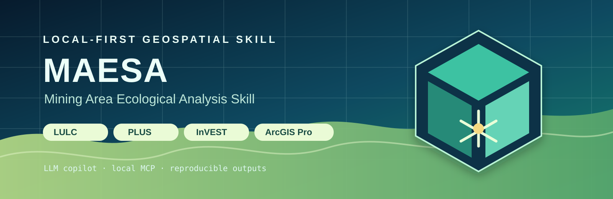

<p align="center">
  
</p>

<p align="center"><strong>MAESA Agent · Local-first mining ecological analysis</strong></p>

# MAESA Agent

MAESA（Mining Area Ecological Space Analysis）将矿区遥感分类、PLUS 情景预测、InVEST 与生态服务评价组织为可验证的本地工作流。用户提供本地数据和 `project.json`；Agent 校验空间数据、编译可续跑任务、调用已安装的软件，并保存完整的成果与来源记录。

它支持多期土地利用分类、转移 Sankey、PLUS ND/UD/EP/RE、InVEST Carbon/Water Yield/Habitat Quality、沉陷积水碳库、生态服务综合评价和 ArcGIS Pro 出图。

> **Local-first.** MCP 只连接本机服务；ArcGIS Pro、ENVI、PLUS 和 InVEST 不接受公网远程控制。云端 LLM 如被启用，也只负责受约束的文本规划。

## 能力边界

| 模块 | 本机实现 | 结果 |
|---|---|---|
| 项目构建、空间预检、清单和续跑 | Python | 自动 |
| ENVI 监督分类 | IDL/ENVI 桥接 | 需要本机许可 |
| PyTorch 分类 | 已登记模型的本地推理 | 需要独立验证 |
| PLUS 四情景 | 官方快照 GUI 桥接 | 首次需要校准界面 |
| InVEST 与生态服务 | 本机 CLI/Python | 输入完整时自动 |
| 制图与沉陷库容 | ArcPy / ArcGIS Pro | 需要本机许可 |

`prepared`、`waiting_interactive` 和 `pending_validation` 都表示尚未完成，不会被写成分析成功。

## 安装方式

### 方式 1：作为 Agent Skill 安装

```powershell
npx skills add lancmd/MAESA-Agent -g
```

安装后，在支持 Skill/MCP 的 Agent 平台中启用 `mining-area-ecological-space-analysis`。该方式提供工作流说明、MCP 注册信息和本地工具代码；它不会安装商业 GIS 软件或复制研究数据。

### 方式 2：本地开发和运行

```powershell
git clone https://github.com/lancmd/MAESA-Agent.git
cd MAESA-Agent
.\scripts\setup_agent.ps1 -WithPyTorch -WithPlusGui
.\scripts\maesa_doctor.ps1
.\scripts\start_agent_mcp.ps1
```

本地测试和实际分析请使用第二种方式。MAESA 不只是文本 Skill：ENVI、ArcGIS Pro、PLUS、InVEST、GPU 和研究区数据都在本机，由本地 MCP 协调。

若 PowerShell 执行策略阻止 `.ps1`，不需要修改系统全局策略；可在当前命令中临时绕过：

```powershell
powershell -ExecutionPolicy Bypass -File .\scripts\maesa_doctor.ps1
```

若 `8765` 已被占用，启动脚本会报告占用进程并提示替代命令：

```powershell
.\scripts\start_agent_mcp.ps1 -Port 8766
```

创建或检查项目：

```powershell
python .\scripts\project_validator.py --project .\project.json
python .\scripts\project_workflow.py --project .\project.json --run
```

工作流会生成 `workspace/generated/workflow_job.json`，无需手写 job 文件。

## 首次数据交接

按启用模块提供数据，而不是一次性提供全部材料：

- 分类：逐期影像、逐期 ROI 或模型包，以及独立验证样本；
- PLUS：至少两期已对齐 LULC、驱动因子和矿区边界；RE 还需要正向下沉深度栅格或受约束的 `w.dat`；
- Carbon：LULC 和覆盖全部类别代码的碳密度 CSV；
- Water Yield：降水、ET0、土壤、流域和生物物理表；
- Habitat Quality：威胁因子栅格、威胁表和敏感性表；
- 制图：可选 `.aprx`、布局和 `.lyrx`。

复制 [`examples/real_project_template`](examples/real_project_template/README.md) 到自己的项目目录，填入六期影像、ROI、验证样本、驱动因子和 InVEST 数据栈后再运行。分类输入预检会检查 ROI 字段、类别、有效几何和 CRS，并在模型运行前汇总各类别验证样本数。

## 本机诊断

个人软件路径写入被忽略的 `config/local_paths.json` 或环境变量，不提交到仓库。

| 软件 | 环境变量 |
|---|---|
| ArcGIS Pro | `ARCGIS_PROPY`、`ARCGIS_PRO_EXE` |
| ENVI / IDL | `IDL_EXE` |
| PLUS | `PLUS_V142_EXECUTABLE` |
| InVEST | `INVEST_CLI` |

```powershell
.\scripts\maesa_doctor.ps1
```

Doctor 一次显示 Python/MCP/rasterio、后端注册表、ArcGIS Pro/ENVI/PLUS/InVEST、CUDA/GPU 和当前项目的 LULC 声明。`python .\scripts\workflow_agent.py probe` 仍可输出完整的机器能力 JSON。

## 验证与发布前测试

每个项目生成 `outputs_manifest.json`、`provenance.json`、`validation_summary.json` 和 `agent_state.json`。验收包括 LULC 的 OA/F1/IoU、PLUS 的 FoM/类别精度/随机种子稳定性、InVEST 一致性、生态服务敏感性，以及地图图层、范围和分辨率检查。每次 InVEST 运行前还会生成模型对应的 `invest_*_parameter_report.md`，记录实际 LULC、碳密度、威胁参数和验证结果。

```powershell
python -m pytest .\tests\test_smoke_suite.py -q
python .\tests\mcp_smoke.py
```

GitHub Actions 在 Windows Python 3.11 和 3.12 上运行可移植测试；商业 GIS 软件仅在本地小栅格测试。

## 目录

```text
MAESA-Agent/
├── agents/       # Agent 客户端连接定义
├── config/       # 本地路径与 GUI 配置示例
├── docs/         # 任务中心文档
├── mcp_server/   # 本地 MCP 服务
├── scripts/      # 工作流编译器和软件桥接
├── templates/    # 项目与数据栈模板
├── examples/     # 匿名演示与真实项目模板
└── tests/        # 可移植与本地集成测试
```

MAESA-Agent 0.4.1 使用 [MIT License](LICENSE)。它编排已经安装的软件，不分发 ArcGIS Pro、ENVI、PLUS 或 InVEST 的许可，也不替代独立的数据和科研验证。
